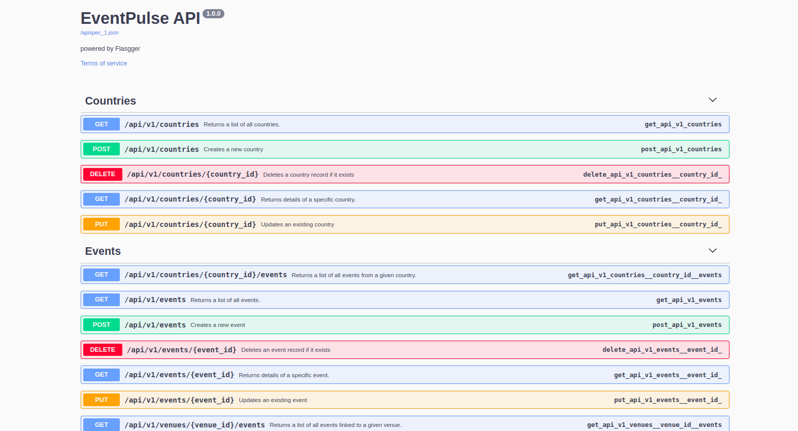

Got it! Here is the code you can directly copy and paste into your GitHub repository's backend README:

```markdown
# EventPulse - Backend
### An event management system API built with Flask and SQLAlchemy

EventPulse Backend API provides data for managing events, users, and venues. It seamlessly integrates with the EventPulse platform and supports various functionalities to manage events and related information.

For more details on available endpoints and supported methods, please check the API documentation:  



---

## 📦 Installation

### Prerequisites

To run the EventPulse API, you'll need the following:

- **MySQL** version 5.7.*
- A [Cloudinary](https://cloudinary.com/) account for image and file uploads.

---

### 🔑 Environment Variables

Ensure the following environment variables are set up correctly:

#### Cloudinary Credentials
- `CLOUDINARY_NAME` - The name of your Cloudinary application.
- `CLOUDINARY_KEY` - The application key.
- `CLOUDINARY_SECRET` - The application secret key.

#### Database Configuration
- `EVENTPULSE_USER` - The database username (default: `eventpulse_dev`).
- `EVENTPULSE_PWD` - The password for the database user (default: `eventpulse_dev_pwd`).
- `EVENTPULSE_HOST` - The IP address of the database server (default: `localhost`).

#### Application Configuration
- `EVENTPULSE_PORT` - The port the application will run on (optional, defaults to `5000`).

---

## 🛠️ Setup

### 1️⃣ Setting up the Database

To set up the MySQL database for EventPulse, execute the following command:

```bash
cat setup_mysql_dev.sql | mysql -uroot -p
```

This will create the necessary tables and schemas.

### 2️⃣ Setting up the Project

#### Clone the Repository

Start by cloning the repository:

```bash
[git clone https://github.com/RyanIdris41/Event-Management-System-MERN-.git]
cd eventpulse-flask
```

#### Install Dependencies

Next, install the required dependencies using **pip**:

```bash
pip install -r requirements.txt
```

#### Launch the Application

To start the Flask application, use the following command:

```bash
python -m api.v1.app
```

This will start the application, and you can access the API at:

```
http://localhost:5000
```

---

## 📝 License

This project is licensed under the [MIT License](https://github.com/ivanagui2/VMQemuVGA/blob/master/LICENSE.txt).

---

## 🙏 Acknowledgements

- **Flask** for providing the lightweight backend framework.
- **SQLAlchemy** for the powerful ORM that makes database interaction seamless.
- **Cloudinary** for media file management.
```

Just copy the above code and replace the existing backend README with this one in your GitHub repository. Let me know if you need any further modifications!
