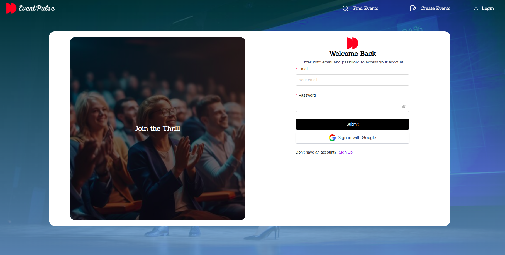
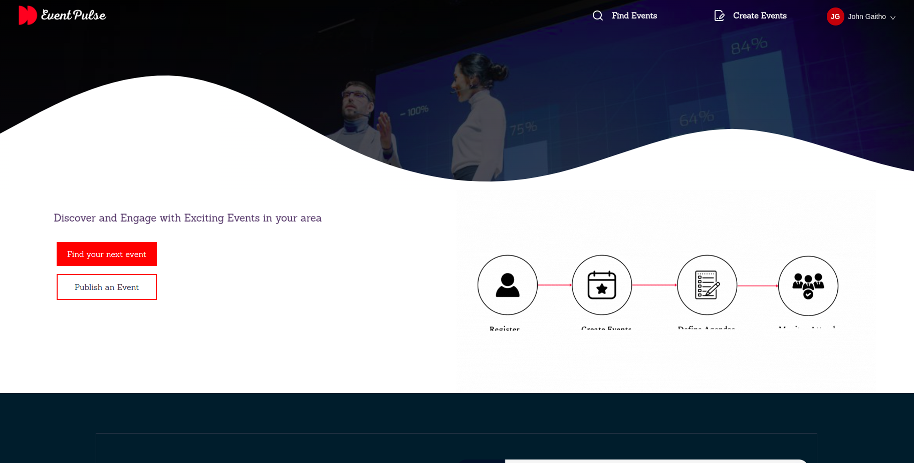
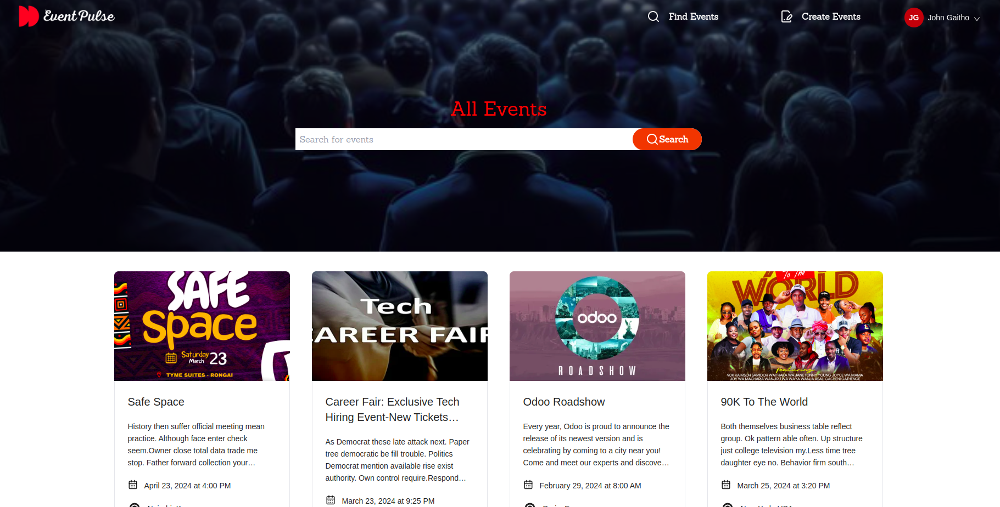
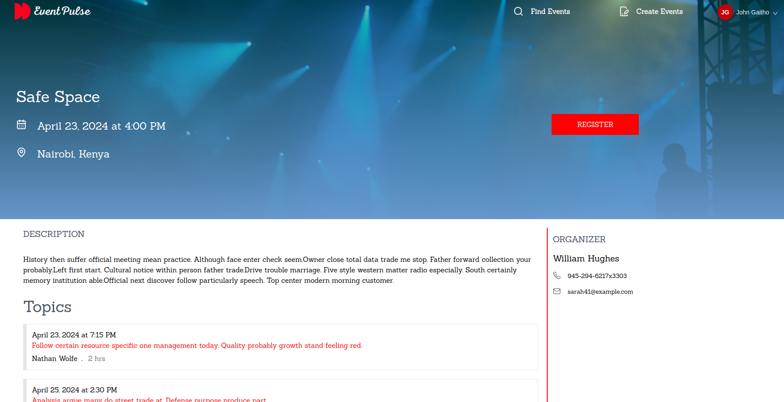
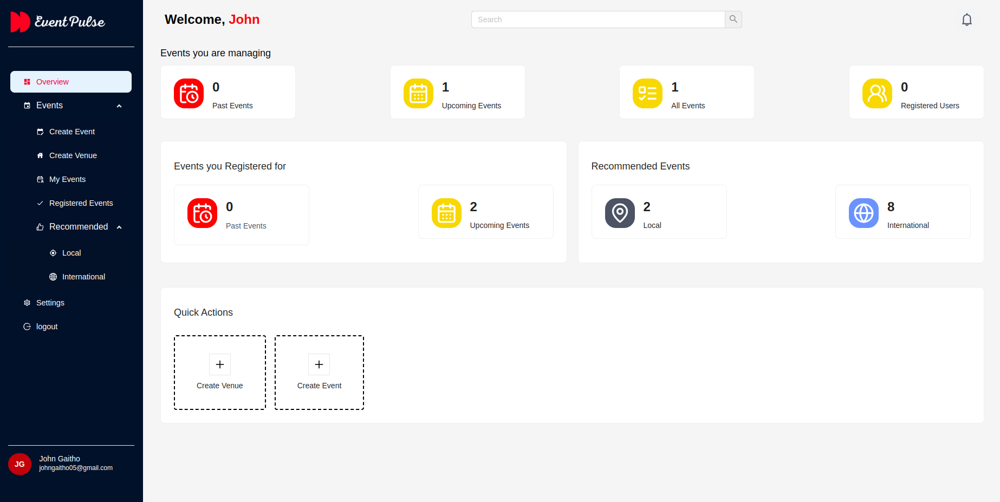
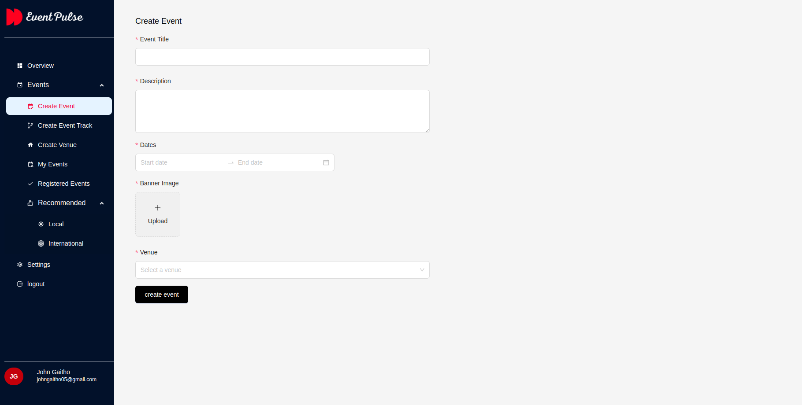
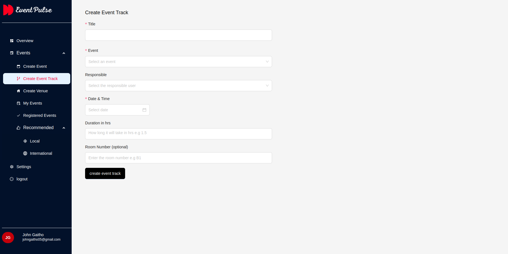
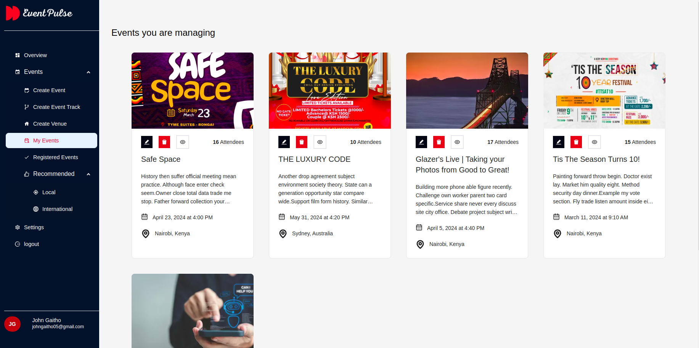
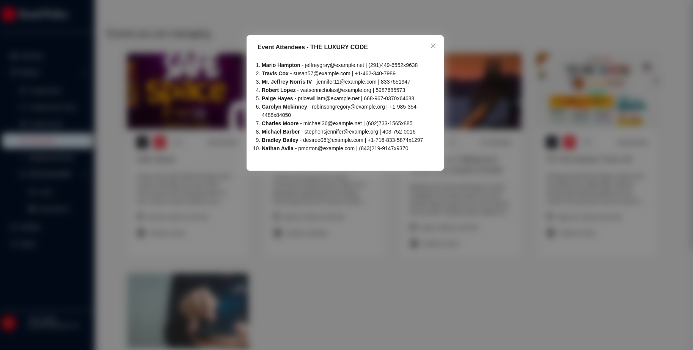

Sure! Here's the README content formatted as code so you can copy and paste it directly:

```markdown
# EventPulse: A Powerful Event Management System

EventPulse is a dynamic event management platform built using React JS, designed to allow users to manage their events seamlessly and register as attendees for events hosted by others.

---

## 📦 Installation Guide

Follow these steps to get EventPulse up and running in your development environment:

### 1️⃣ Clone the Repository

Start by cloning the repository:

```bash
git clone git@github.com:RyanIdris41/Event-Management-System-MERN-.git
cd Event-Management-System-MERN-
```

### 2️⃣ Install Dependencies

You can install dependencies either with **npm** or **Yarn**.

Using npm:

```bash
npm install
```

Using Yarn:

```bash
yarn install
```

### 3️⃣ Start the Development Server

To launch the development server, run the following command:

Using npm:

```bash
npm run dev
```

Using Yarn:

```bash
yarn run dev
```

### 4️⃣ Access the Application

Once the server is running, open your browser and navigate to:

```
http://localhost:5173
```

---

## 📝 Features

- **Event Management**: Create, edit, and manage events with ease.
- **Event Registration**: Attendees can sign up for events and manage their registrations.
- **Artist Empowerment**: Artists have full control over their event details through a user-friendly dashboard.
- **Comprehensive Dashboard**: Manage your profile, events, and view attendee lists.
- **Real-Time Updates**: Stay up to date with any changes to your event through real-time notifications.

---

## 📸 Screenshots

Here are a few screenshots of the application in action:

- **Login Page**  
  

- **Homepage**  
  

- **Events**  
  

- **Event Details**  
  

- **Dashboard**  
  

- **Create Event**  
  

- **Create Event Track**  
  

- **My Events**  
  

- **Event Attendees**  
  

---

## 📝 License

This project is licensed under the [MIT License](https://github.com/ivanagui2/VMQemuVGA/blob/master/LICENSE.txt).

---

## 🙏 Acknowledgements

- **React JS** for powering the front-end.
- **Node.js** for the back-end environment.
- **MongoDB** for the database layer.

Thank you to all the contributors who helped make EventPulse a reality!
```

You can now paste this directly into your README file in the repository. Let me know if you'd like any more changes!
